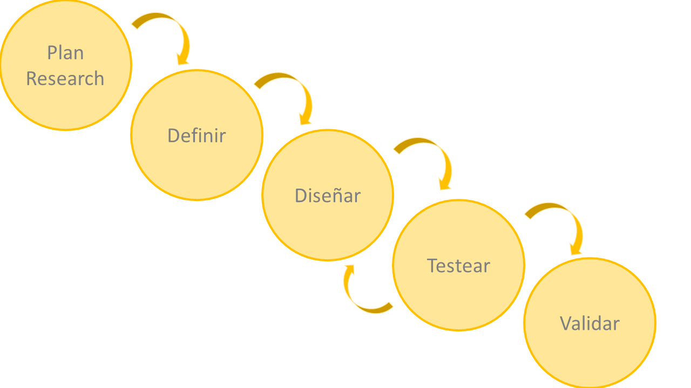
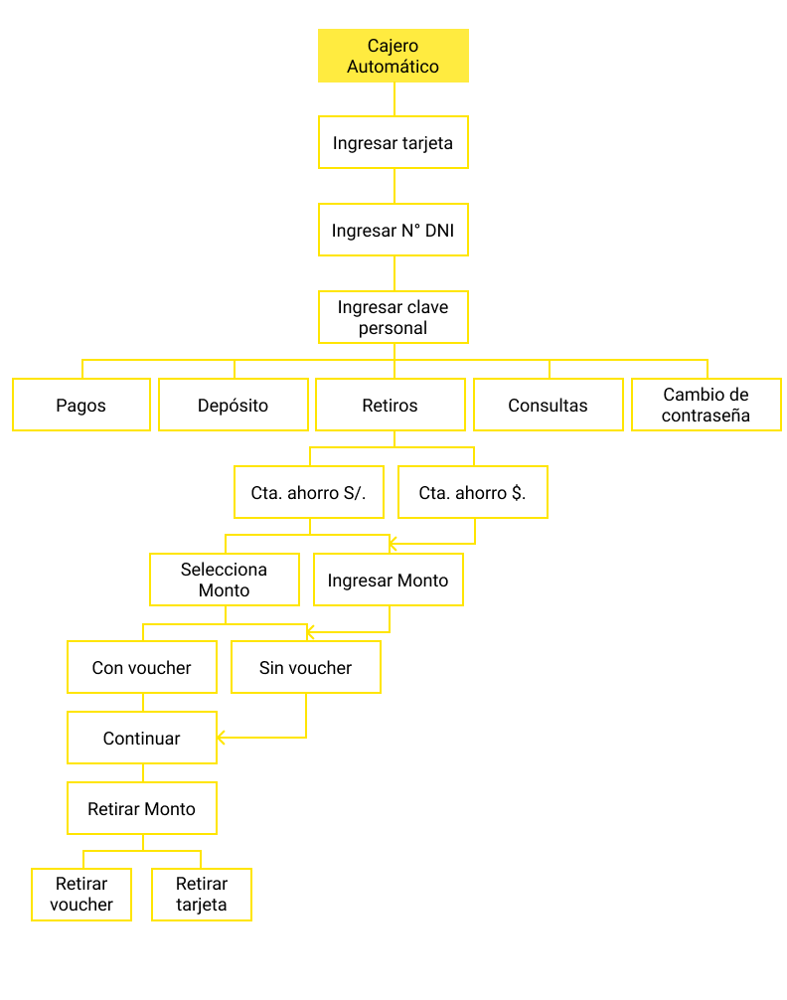
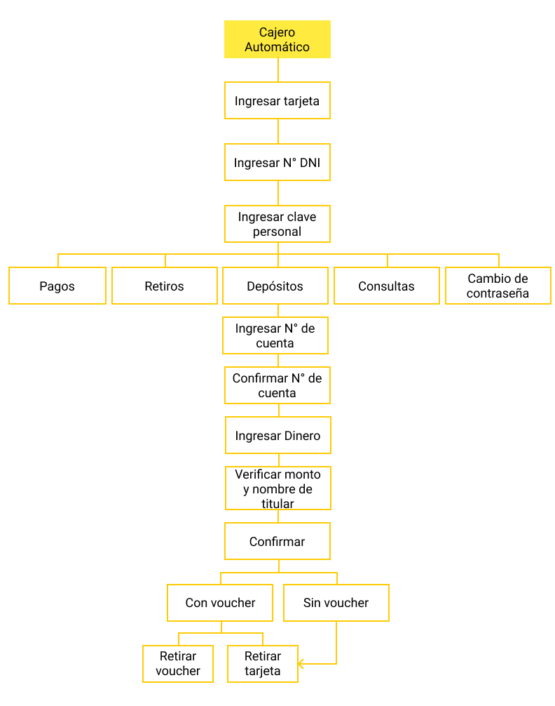
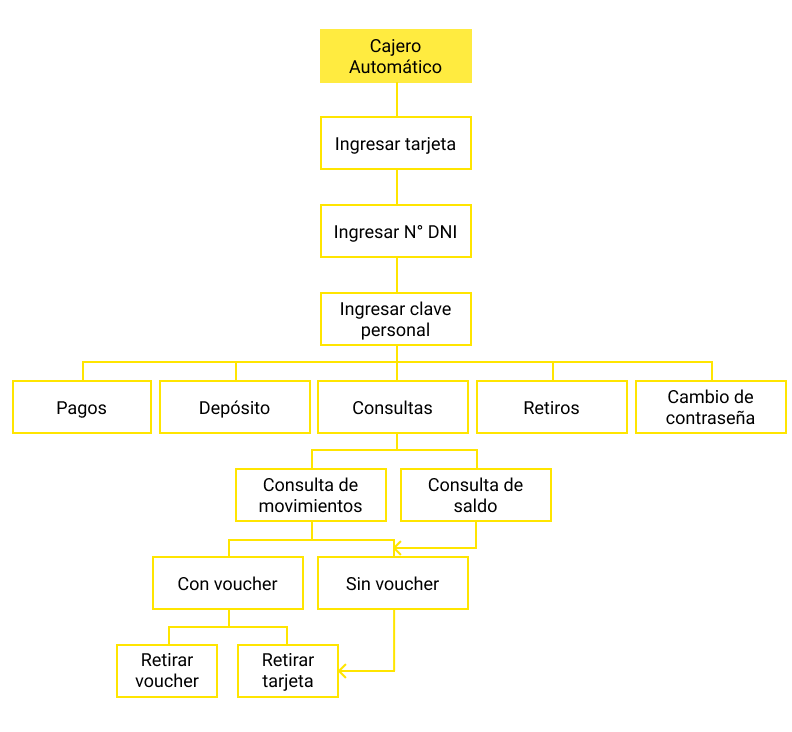
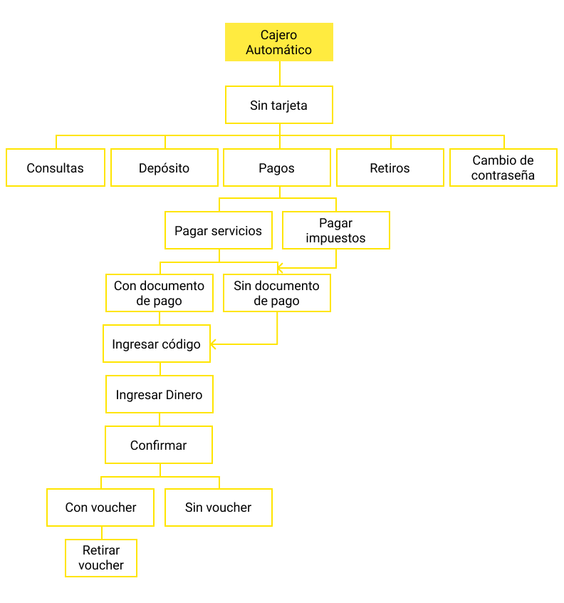
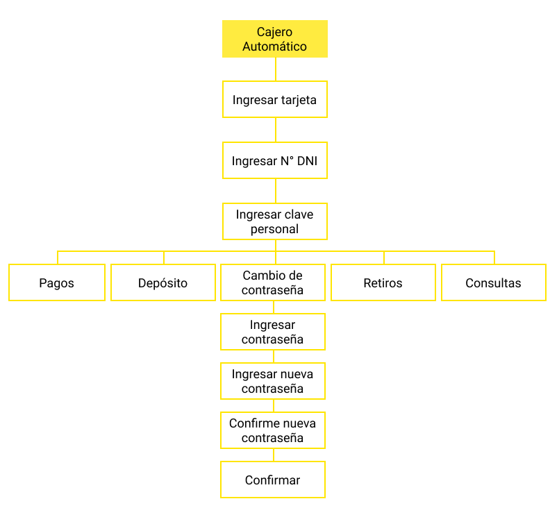

# Cajero automatico:

El cajero automático es una máquina que entrega y recibe dinero, que funcionan activadas mediante una tarjeta y una clave secreta personal, que identifica a un usuario.

## Desarrollado para:

[Laboratoria](http://www.laboratoria.la/)

## Contexto:
Los cajeros automáticos juegan un rol importante en el avance de Los canales modernos del sistema financiero. Ha sido tal el impacto a tal punto que hoy cada 215 segundos se instala un nuevo cajero automático en el mundo y en ellas se realizan 61.7 billones de disposiciones de efectivo anuales.

## Proceso de desarrollo:

En el proceso de desarrollo se va analizar cuáles serían las metodologías para poder llevar a cabo con éxito el producto que queremos desarrollar.

### Plan Research:

1. **Objetivo:**

   * Planear: la investigación cuantitativa y cualitativa.
   * Reclutar: personas que cumplan el perfil ideal para validar supuestos.
   * Conducir: la investigación de la problemática y expectativas de los usuarios.
   * Analizar: supuestos y validaciones.
   * Reportar: conclusiones y feedbacks.

2. **Metodología:**

   * Revisión de Fuentes Externas:
     - Recopilación y conclusiones de investigación de servicios ya existentes.
     - Información de los servicios de la competencia.
   * Entrevistas.
     - Lista de perfiles a quienes evaluar.
     - Guía de entrevistas.
     - Modelo de entrevistas.

3. **Técnicas**
   * Research Cualitativo.
   * Research Cuantitativo.
   * Focus Group.
   * Card Sorting.
   * Arquitectura de Información.
   * User person.
   * Testing.
   * User Journey.
   * Wireframes.
   * Interacción.

4. **Estrategia**

   * Entrevistas presenciales.
   * Recabar información ya existentes de investigación de usabilidad, perfiles, negocio, etc.
   * Entrevistas se realizará de noche.

#### Research Cualitativo:

##### Entrevistas:

**Entrevista:**

**1. Preguntas y Respuestas de Usuarios**

     Medio: Vía telefónica

| Entrevista | Link |
|:----------:|:----:|
| Preguntas y Respuestas | <> |

**2. Conclusiones:**

* Actualmente se pueden hacer más operaciones en los Cajeros Automáticos a comparación de hace 18 años apróximadamente.
* Las operaciones que más se hace en un cajero automático son depósitos, retiros y transferencias de dinero.
* A la mayoría le piden datos de N° DNI de usuario y clave personal.
* Todos los entrevistados saben de otras operaciones que se puede hacer en un cajero automático, pero no lo hacen porque prefieren hacerlo a través de sus aplicaciones móviles.
* La mayoría acude a los cajeros automático de Interbank, BCP, BBVA y Scotiabank.
* Algunos han tenido dificultad al usar por primera vez un cajero automático, ya que les hubiesen preferido recibir orientación por parte del personal del banco.
* Uno de los problemas que han tenido al hacer alguna operación en el cajero automático, era porque a veces no había dinero, se les atoró la tarjeta, el sistema se puso lento, etc.
* La mayoría no cambiaría el proceso para hacer una operación en el cajero automático, porque es entendible.
* Añadir la opción de billete de diez soles y monedas.

#### Research Cuantitativo:

##### Encuesta Online:

| Encuesta Online | Link |
|:---------------:|:----:|
| Stakeholders | <> |

##### Datos Estadísticos:

**Conclusiones:**

* Más del 90% ha usado cajero automático.
* La mayoría acude al cajero automático de los bancos de Scotiabank, BCP, BBVA y Banco de la Nación.
* Más del 85% acude una vez por semana al cajero automático y el 13% hasta tres veces por semana.
* El 100% realiza la operación de **Retiro de dinero**, seguido de depósito de dinero (40%) y ver saldo de tarjeta (20%).
* A la mayoría le pide datos como N° DNI y clave personal de usuario (4 dígitos) para poder hacer una operación bancaria.
* Antes no pedían N° DNI.
* Ahora se pueden hacer más operaciones en los cajeros automáticos.
* Les gustaría implementar la opción de poder retirar monedas y billetes de diez soles.
* Que ya no se utilizen los botones ATM, ya que no concuerdan con las operaciones. Por eso proponen cambiarlos por pantallas táctiles.

### Definición:

#### Benchmarking:

##### Análisis competitivo:

Las funcionalidades que debe tener el sistema de **cajero automático**

* **Acceso directo** según el medio usado (tarjeta o N° DNI).
* **Pantalla inicial** con acceso rápido a la retirada de efectivo y acceso al resto de acciones.
* **Zona inferior de navegación con acciones fácilmente identificables** (cancelar, atrás, configuración, etc.) y **aspecto renovado para opciones de apoyo:** salir del cajero o configuración.
* **Nueva** visualización de la información que más legible.
* **Botones grandes muy bién diferenciados**, donde la acción principal está más destacada.
* **Iconos sencillos** con textos explicativos.

##### Análisis comparativo

| Banco | Acceso Directo| Pantalla inicial con acceso rápido| Fácil de navegar | Buena visualización | Botones grandes muy bién diferenciados | Iconos sencillos |
|:-----:|:-------------:|:---------------------------------:|:----------------:|:-------------------:|:--------------------------------------:|:----------------:|
|**BCP**|**NO**|**NO**|**SÍ**|**SÍ**|**NO**|**NO**|
|**BBVA**|**NO**|**NO**|**SÍ**|**SÍ**|**NO**|**NO**|
|**Scotiabank**|**NO**|**NO**|**SÍ**|**NO**|**NO**|**NO**|

#### User Persona:

#### Mapa del sitio:

Para esto se empleo el método de **card sorting**

| Card Sorting | Link |
|:----------:|:----:|
| Imágenes| <> |

#### Mapa de Arquitectura:

##### Retiro:

##### Depósito:

##### Consultas:

##### Pagos:

##### Cambio de clave:

### Diseño:

#### Wireframes:
